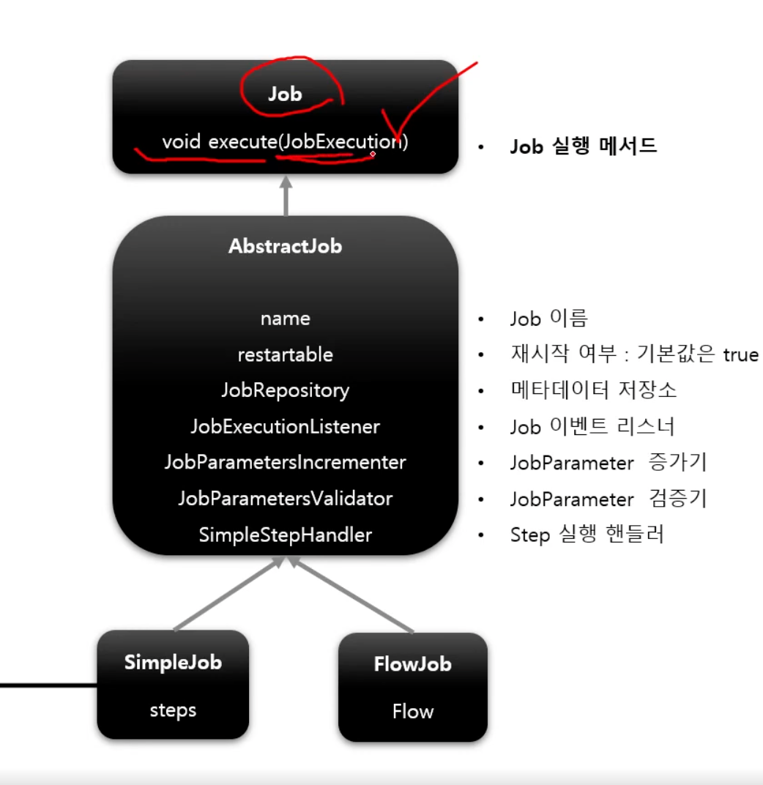

# Job

## 기본 개념 

- 배치에서 가장 상위에 있는 개념이다. 
  - 하나의 배치 작업 자체를 의미한다고 생각하면 됨.
  - API 서버의 로그를 통계 서버의 로그로 옮기는 배치 = Job 하나.
- Job Configuration 을 통해서 생성되는 객체 단위다. 배치 작업을 어떻게 구성하고 실행할 것인지 전체적으로 설정하고 명세해놔야한다. 
- 배치 Job 을 구성하기 위한 최상위 인터페이스다. 스프링 배치가 기본 구현을 제공한다. 
- 여러 Step 을 포함한다.
- 실제로 만들 땐 builder 패턴으로 만든다.

## 기본 구현체 

- SimpleJob
  - 순차적으로 실행하는 Job
- FlowJob
  - 특정한 조건과 흐름에 맞춰서 실행하는 Job
  - Flow 객체를 통해서 작업 

## hierarchy

- jobEventListener 를 통해서 잡의 실행과 관련된 이벤트를 받아서 특정 작업을 시작할 수 있다.
- SimpleStepHandler 를 통해서 Job 내부의 Step 을 실행한다.

## JobLauncher 

- Job 을 실행시키는 주체 
  - 실행 시키기 위해서는 Job 객체와 Job Parameter 객체 두 개 필요하다.
- `job.execute()` 를 통해서 job 이 실행되고 내부 step 을 순차적으로 실행된다. (SimpleJob 기준)
  - 내부의 steps 라는 step 리스트를 가지고 있다.
