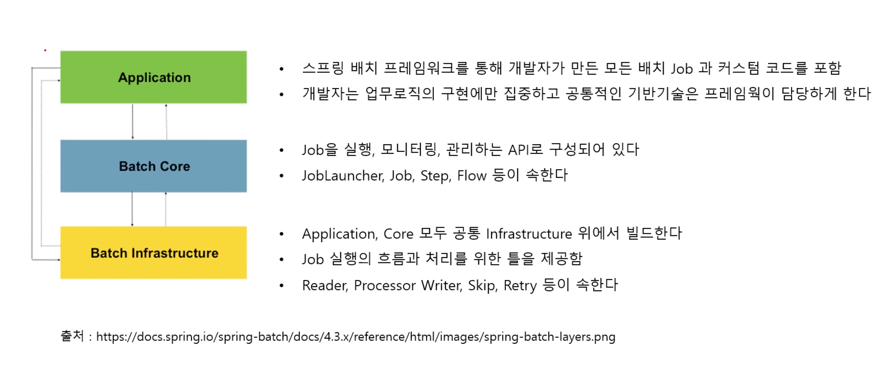

# 개요 및 아키텍처 

## 스프링 배치의 탄생 

- 자바 진영에서는 배치 기술이 없었다.
  - 그래서 spring source (현재 pivotal) 과 Accenture (경영 컨설팅) 이 합쳐서 스프링 배치를 만듦.
  - Accenture 는 배치 아키텍처를 구현하면서 쌓은 기술과 노하우가 있었고 SpringSource 는 기술적 기반이 있었음.

## 배치 핵심 패턴 

- Read
  - 데이터베이스, 파일, 큐에서 다량의 데이터를 조회한다.
- Process
  - 특정 방법으로 데이터를 가공한다.
- Write
  - 데이터를 수정된 양식으로 다시 저장한다.
- **(읽고 가공하고 저장하는게 배치의 핵심 패턴 ETL 과 유사. 스프링 배치는 이 세가지 항목이 잘 설계되었음.)**

## 배치 사용 시나리오

- 배치 프로세스를 주기적으로 커밋
  - 대용량의 데이터를 처리한다고 했을 때 한번에 이를 다하지 않는다. (여러 문제가 있겠지. 메모리 포함해)
  - 그러므로 데이터를 쪼개서 처리하고 커밋 해야한다.
- 동시 다발적인 Job 의 배치 처리, 대용량 병렬 처리
  - Job 도 동시에 실행시킬 수 있고, Job 간 간섭이 없도록 지원한다.
  - 더 빠른 처리를 위해서 병렬 처리도 지원한다.
- 실패 후 수동 또는 스케줄링에 의한 재시작
- 의존관계가 있는 step 여러 개를 순차적으로 처리
  - Job 안에는 Step 이 여러개 있다. 이 Step 들을 순차적으로 실행하도록 지원한다.
- 조건적 Flow 를 통해 체계적이고 유연한 배치 모델 구성
  - 경우에 따라서는 순차적 처리가 아닌 조건적인 처리가 필요할 수도 있다. 이게 Flow 다. (조건에 따라서 처리하는.)
- 반복, 재시도, Skip 처리를 지원한다.
  - 배치는 반복적으로 실행하고 재시도도 지원해야한다. 그리고 필요하다면 skip 할 수도 있어야한다.

## 배치 아키텍처 

- 총 3개의 레이어가 있다.
- Application
  - 스프링 배치 프레임워크를 통해서 개발자가 만든 Job 과 코드들을 말한다.
  - 개발자는 로직에만 집중하면됨.
- Batch Core
  - Job 을 실행하고, 모니터링하고, 관리하는 API 로 구성되어있다.
  - JobLauncher, Job, Step, Flow 등이 속한다.
- Batch Infrastructure
  - Application, core 모두 배치 인프라스트럭처에서 실행된다.
  - Reader, Writer, Processor, Skip, Retry 등이 속한다.

## General Batch Principles and Guidelines

- 리소스 사용을 최소화로 실행하는 것. 내부 메모리에서 처리할 수 있다면 그렇게 하는 것. 
- 불필요한 I/O 를 줄이는 것 
  - 불필요한 테이블/인덱스 스캔을 줄이는 것 
  - 한번만 읽으면 되는 데이터를 여러번 읽지 않도록 하는 것. 

- 배치를 두 번 실행하지 않는 것. 똑같은 데이터가 두 번 처리될 필요가 없다면 처리하지 않는 것. 
- 충분한 메모리를 할당해서 프로세스 중 메모리 재할당을 피해라. (메모리 재할당에 대해서 궁금하다.) 

- 데이터 무결성에 대한 최악의 상황에 대비해라. 필요하다면 validation 검사를 추가해라 데이터 무결성 검사를 위해서.

- 가능하다면 데이터 내부 검증을 위한 체크섬을 구현해라. 예를 들면 파일에는 총 레코드의 개수와 각 필드의 집계를 할 수 있어야 한다.

- 가능한 빨리 실제 환경의 데이터를 가지고 테스트를 해봐라.

- 백업에 신경써야한다. 데이터베이스의 경우에는 특히 쉽겠지만 파일로 관리하는 경우에는 백업 절차가 구축되어 있어야한다.

- 정리하자면 이렇다.
  - 효율성 
    - 가능하다면 메모리에서 실행
    - 메모리 재할당을 피하자. 
    - 불필요한 I/O 를 줄이자.
    - 불필요한 배치 실행과 데이터 처리를 막자. 
  - 데이터 무결성을 신경쓰자. 
    - 신경써야 하는 데이터가 있다면 이를 검사하자. 
  - 백업에 신경쓰자. 
    - 백업은 모든 데이터를 말한다. 
    - 메타 데이터, 처리 후의 데이터, 처리 전 데이터, 로그, 중간 데이터 등

## Batch Processing Strategies

일반적인 배치 어플리케이션의 경우 다음과 같다. 주요 구성요소를 step 별로 작성해야하고 비즈니스 로직을 decompose 해야함. 

- Conversion
  - 외부에서 제공받은 데이터를 처리하기 위해 포맷을 변환하는 것. 
- Validation
  - 입력 및 출력 레코드가 일관성이 있는지 검사하는 것.
- Extraction 
  - 레코드를 읽고 규칙에 따라 레코드를 선택하고 output 파일이나 데이터베이스에 레코드를 작성하는 것. 
- Extraction/Updating
  - 레코드를 읽고 규칙에 따라 레코드를 선택하고 이 변경 사항을 적용한느 것.
- Processing/Updating 
  - 데이터베이스 같은 곳에서 읽고 업데이트하고 출력 처리를 위한 레코드를 생성하는 것 
- Output/Format 
  - 입력 파일을 읽고, 표준 형식에 따라서 변경하고, 다른 프로그램에 전송하는 것.

주요 구성요소 외에도 각 어플리케이션은 다음과 같은 유틸리티 기능을 제공할 수 있다.
- sort
- split
- merge

배치 어플리케이션은 input source 에 따라서 다음과 같이 구별될 수 있다. 
- database
- file 
- message queue

배치에서 처리하는 옵션은 다음과 같다. 
- offline mode 에서 특정 배치 시간동안 정상적인 처리
  - offline mode 는 사용자들과 상호작용 없다는 뜻을 말한다.
  - 온라인 사용자들에게 성능상으로 영향을 주지 않는다는 뜻임. (야간시간)
- Concurrent batch or online processing
  - 온라인 사용자의 트랜잭션 처리와 배치 어플리케이션의 트랜잭션 처리가 같은 데이터베이스에서 일어날 수 있다. 
  - 처리 시스템이 같은 데이터를 처리할 수 있기 때문에 락이 필요하다. 
    - 낙관적 락과 비관적 락. 
    - 낙관적 락은 OLTP 에 적합하고 비관적 락은 배치시스템에 좀 더 적합하다. 
      - 낙관적 락은 경쟁이 치열하지 않음을 가정한다. 동시 사용자 수가 적고, 동시에 같은 데이터에 접근하지 않을 확률이 높다면 이게 적합. 
      낙관적 락은 명시적으로 잠그지 않으니까 성능상으로도 더 좋음.
      - 비관적 락은 이 반대다. 
        - 배치 시스템은 비교적 많은 데이터에 접근하니까 경쟁이 치열할 수 있음을 가정. 
        - 그리고 그 동안 접근하지 못하니까 데이터 무결성 측면에서도 좋음.
- Parallel processing of many different batch runs or job at the same time.
  - 동시에 여러 배치가 작업이 처리되서 효율적
- partitioning (processing of many instances of the same job at the same time)
  - 하나의 job 을 여러개의 인스턴스로 쪼개서 실행한다는 뜻. (하나의 job 에서 병렬처리)
- a combination of the preceding options.
  - 대규모 배치 어플리케이션에서 경과 시간을 줄이기 위해

